## S-Connect

## サービスのURL
[S-Connect](https://s-connect-c2ee3957a547.herokuapp.com/)

## サービスの概要
ユーザーが簡単に募集シフトを確認、参加できるシフト募集アプリです。

## 開発のきっかけ
前職では飲食店で勤務しており、以下のような課題を抱えていました。
#### 管理者側
- シフトが紙媒体で、不足している時間帯が一目ではわからない（蛍光ペンでマークをつけたりして工夫する必要がある）
- 人手不足のときは、従業員に声をかけて交渉する時間がそもそもない
#### 従業員側
- シフトが紙媒体で一つしかないので確認しづらい（自分の時間を確認するぐらいで、足りていない時間帯を把握しづらい）
- シフトの提出が2週間前なので、急な予定変更でバイトに入りたいと思っても入りにくい（どの時間が足りていないのか、誰に連絡したらいいのかなど）

 

以上のような課題から、従業員が簡単に不足しているシフトを把握することができ、いつでも気軽にシフトに参加できるようなアプリを作りたいと考えました。

## 機能一覧
| トップ画面 |　新規登録画面（ユーザー） |
| ---- | ---- |
| 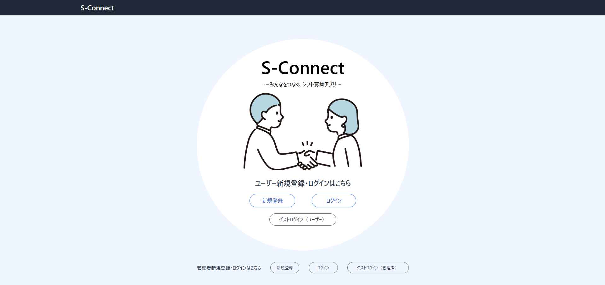 |  |
| 登録せずにサービスをお試しいただくためのトライアル機能を実装しました。 | 名前とメールアドレス、パスワードで登録できるようにしています。 |

| 新規登録画面（管理者） | ログイン画面 |
| ---- | ---- |
| 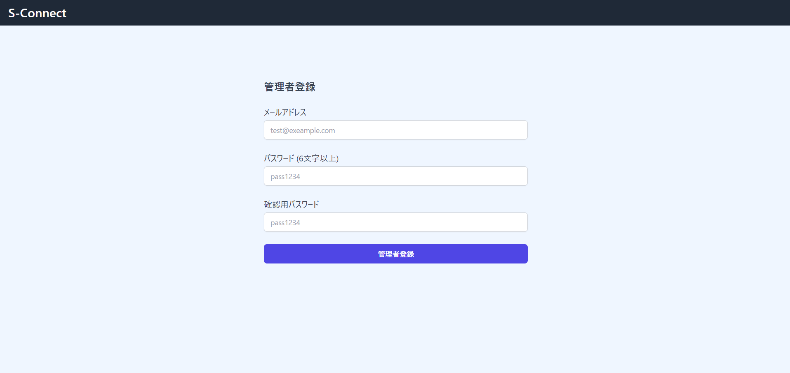 | 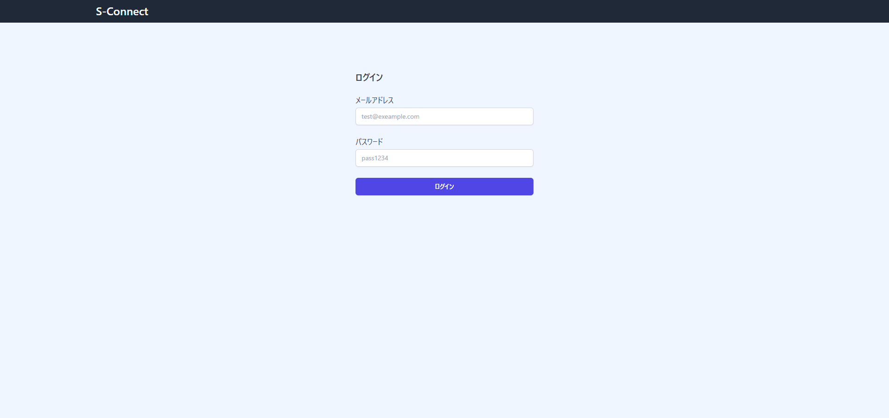 |
| メールアドレスとパスワードで登録できるようにしています。 | メールアドレスとパスワードでの認証機能を実装しました。 |

#### 管理者用機能
| 募集シフト作成画面 |　募集シフト一覧画面 |
| ---- | ---- |
| 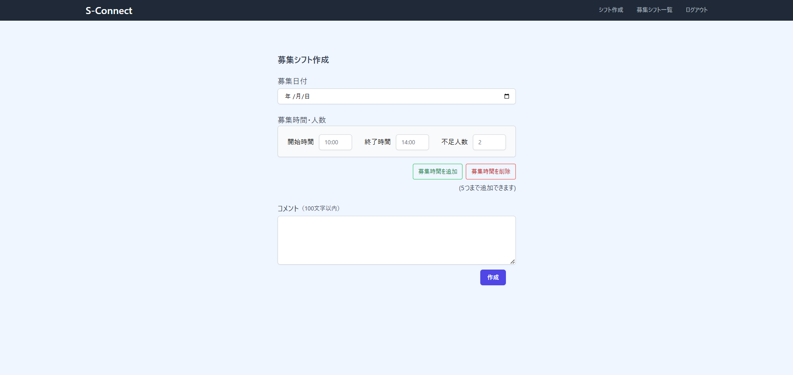 | 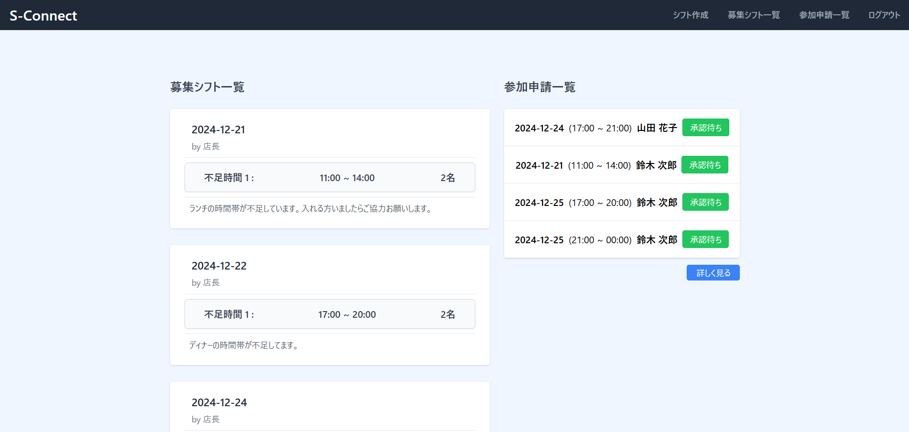 |
| 日付、時間、人数、コメントを入力可能です。「募集時間を追加」で最大5つまで追加できます。 | 作成した募集シフトと、ユーザーからの申請を一覧で見ることができるようにしています。 |

| 募集シフト詳細画面 |　シフト削除のモーダル |
| ---- | ---- |
| 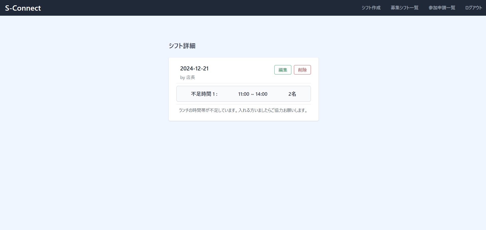 | 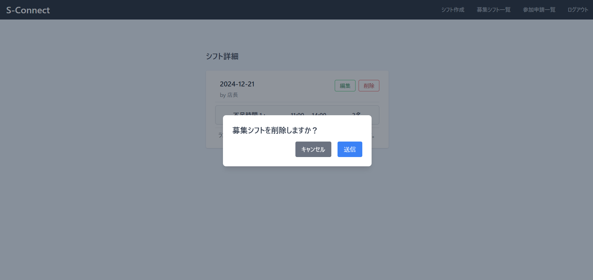 |
| 詳細画面から、募集シフトの編集、削除が可能です。 | シフト削除時のモーダルです。 |

| 募集シフト編集画面 | 参加申請一覧画面 |
| ---- | ---- |
| 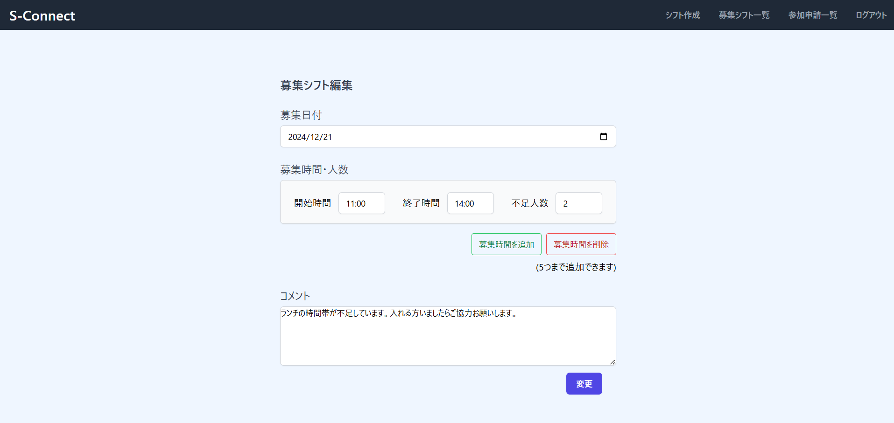 | 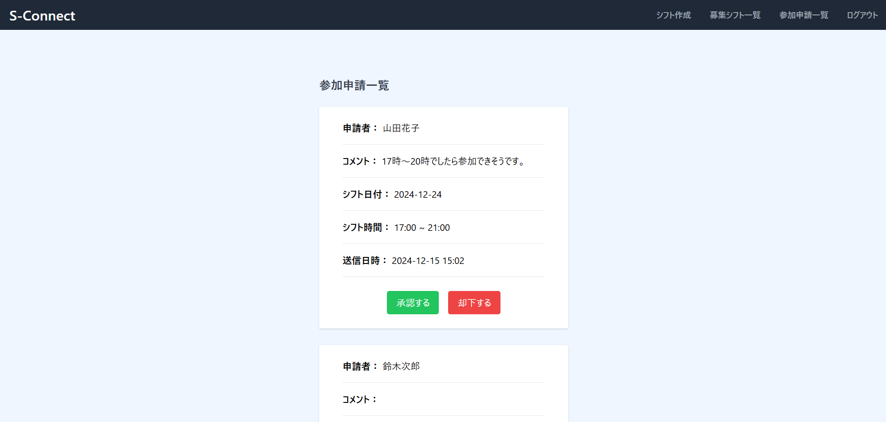 |
| 作成した募集シフトの編集が可能です。 | ユーザーからの参加申請の詳細を確認することができます。ここから「承認」または「却下」ができます。 |

#### ユーザー用機能
| 募集シフト一覧画面 |　募集シフト詳細画面 |
| ---- | ---- |
| 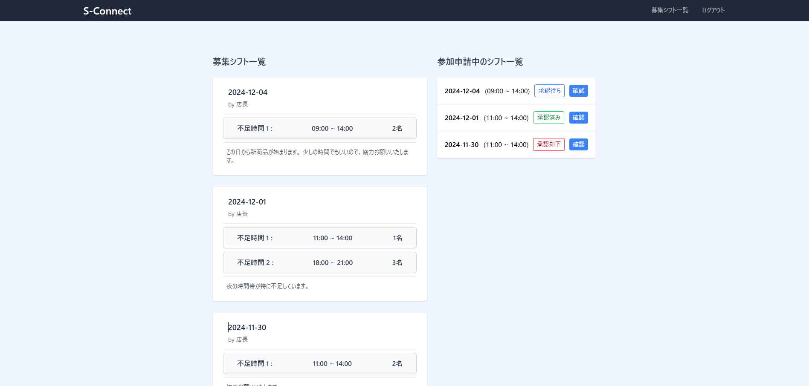 | 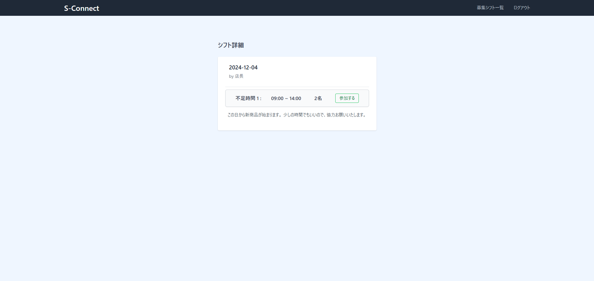 |
| 募集シフトと参加申請中のシフトを一覧で確認することができます。 | 募集シフト詳細ページから参加申請を送ることができます。 |

| 参加申請キャンセル | 参加申請シフト削除 |
| ---- | ---- |
| 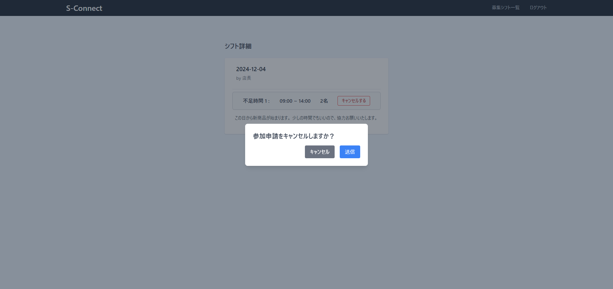 | 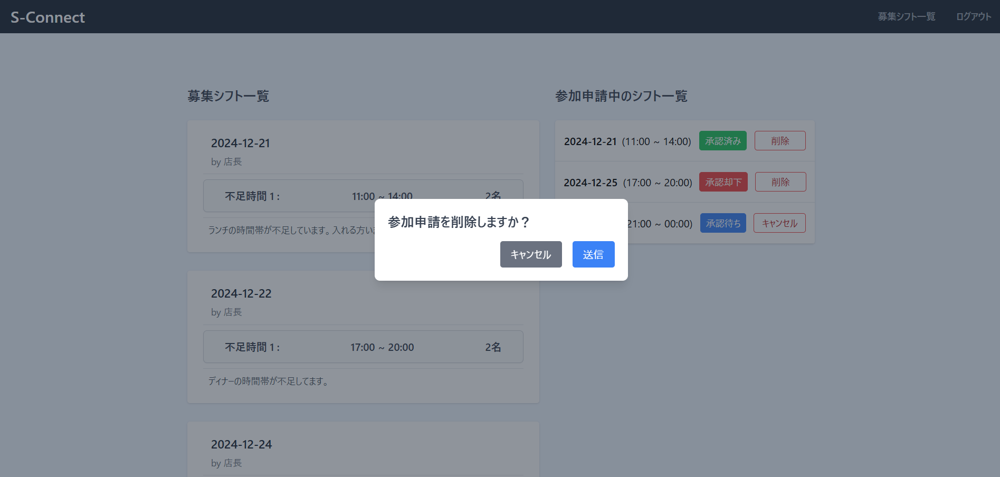 |
| 「キャンセル」から参加申請をキャンセルすることができます。 | 「承認済み」と「承認却下」のとき、シフト一覧からシフトを削除することができます。|

## ER図
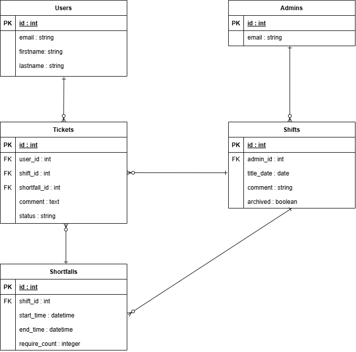

## 使用技術一覧
**バックエンド:** Ruby(3.3.2) / Rails(7.2.2)

- コード解析 / フォーマッター: Rubocop
- テストフレームワーク: RSpec

**フロントエンド:** Tailwind(3.0.0)

- コード解析: ESLint
- テストフレームワーク: Capybara
- CSSフレームワーク: Tailwind CSS

**データベース:** PostgreSQL

**CI / CD:** GitHub Actions

**認証:** Devise
