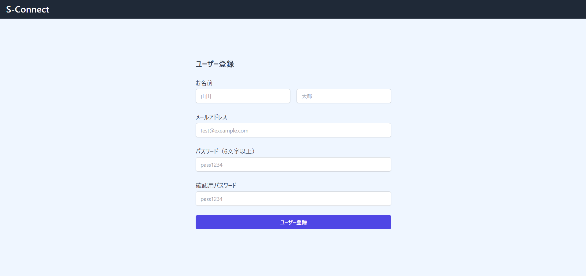
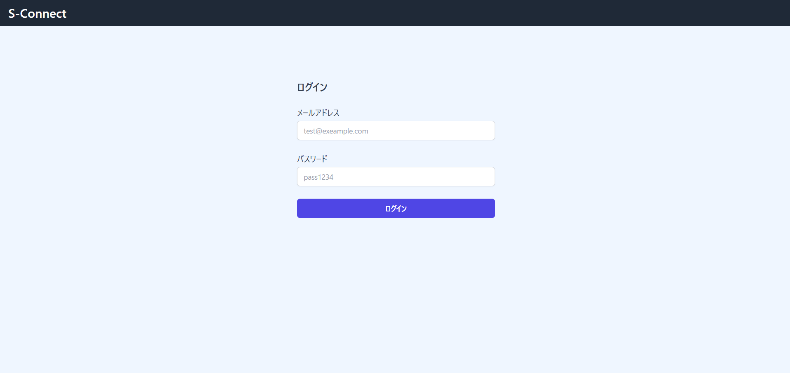
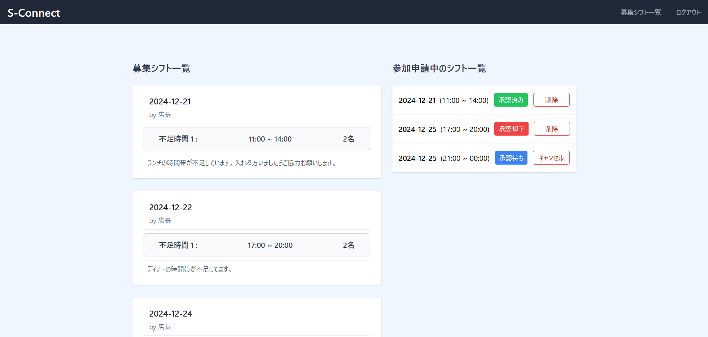
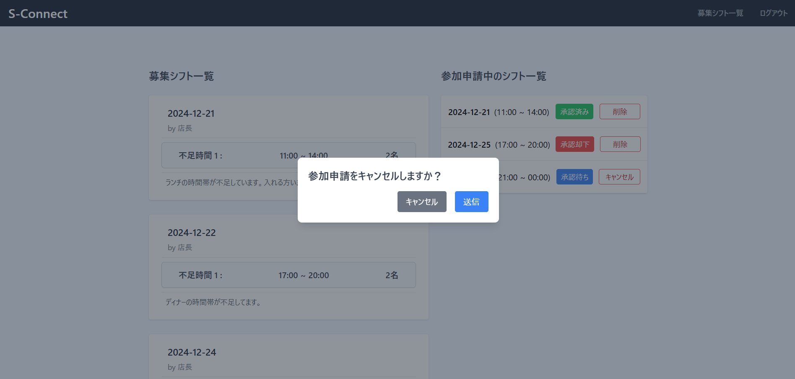

## S-Connect

## サービスのURL
[S-Connect](https://s-connect-c2ee3957a547.herokuapp.com/)

## サービスの概要

## 開発のきっかけ

## 機能一覧
| トップ画面 |　新規登録画面（ユーザー） |
| ---- | ---- |
|  |  |
| 登録せずにサービスをお試しいただくためのトライアル機能を実装しました。 | 名前とメールアドレス、パスワードで登録できるようにしています。 |

| 新規登録画面（管理者） | ログイン画面 |
| ---- | ---- |
|  |  |
| メールアドレスとパスワードで登録できるようにしています。 | メールアドレスとパスワードでの認証機能を実装しました。 |

#### 管理者用機能
| 募集シフト作成画面 |　募集シフト一覧画面 |
| ---- | ---- |
|  |  |
| 日付、時間、人数、コメントを入力可能です。「募集時間を追加」で最大5つまで追加できます。 | 作成した募集シフトと、ユーザーからの申請を一覧で見ることができるようにしています。 |

| 募集シフト詳細画面 |　シフト削除のモーダル |
| ---- | ---- |
|  |  |
| 詳細画面から、募集シフトの編集、削除が可能です。 | シフト削除時のモーダルです。 |

| 募集シフト編集画面 | 参加申請一覧画面 |
| ---- | ---- |
|  |  |
| 作成した募集シフトの編集が可能です。 | ユーザーからの参加申請の詳細を確認することができます。ここから「承認」または「却下」ができます。 |

#### ユーザー用機能
| 募集シフト一覧画面 |　募集シフト詳細画面 |
| ---- | ---- |
|  |  |
| 募集シフトと参加申請中のシフトを一覧で確認することができます。 | 募集シフト詳細ページから参加申請を送ることができます。 |

| 参加申請キャンセル | 参加申請シフト削除 |
| ---- | ---- |
|  |  |
| 「キャンセル」から参加申請をキャンセルすることができます。 | 「承認済み」と「承認却下」のとき、シフト一覧からシフトを削除することができます。|

## 使用技術一覧

## 主要機能一覧